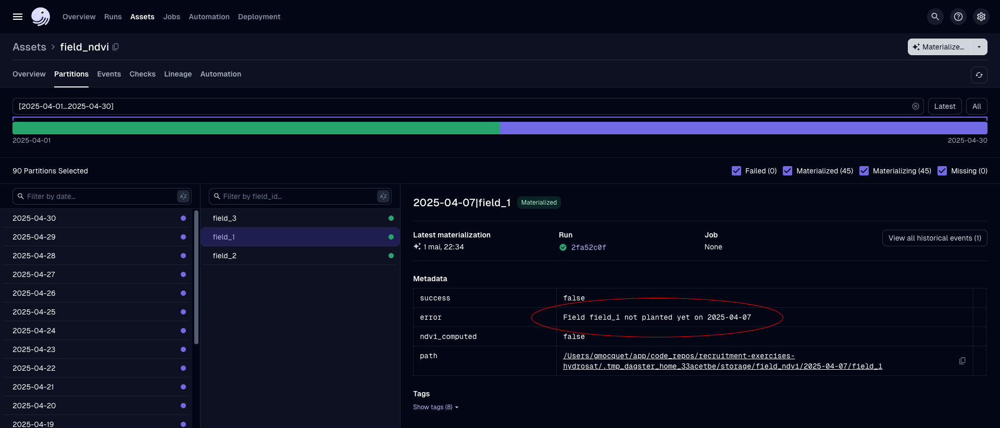

# 🌍 Hydrosat Technical Challenge

Staff Data Engineer: Geospatial Data Pipeline

----

A scalable geospatial data pipeline powered by Dagster and Kubernetes, designed for daily partitioned asset materialization, late data arrival handling, and S3-based I/O management.

> This study analyzes satellite images from the European Copernicus Sentinel-2 mission. These images enable the calculation of NDVI (Normalized Difference Vegetation Index) analysis for fields delineated by green polygons. The project uses COGs (Cloud-Optimized GeoTIFFs) to speed up tile loading times by retrieving only the areas of interest. The fields studied are located in the commune of "[Les Embruns](https://geojson.io/#map=15.04/49.34457/-0.83929)" in Normandy, France.


## 🚀 Features

- **Dagster Orchestration**: Assets are materialized with daily partitions and time-based dependencies.
- **Kubernetes Deployment**: Lightweight cluster setup using Colima with k3s for local development.
- **Infrastructure as Code**: Reproducible deployments using Terraform.
- **S3-Compatible Storage**: MinIO is used to simulate an S3 bucket locally, managed through Terraform.
- **Late Data Handling**: Efficient mechanisms for reprocessing delayed fields without reprocessing the full dataset.

## 🧱 Software Design

- **Static Typing**: The project employs static typing to enhance code reliability and maintainability. By using Python's type hints, developers can catch type-related errors early in the development process, leading to more robust and self-documenting code. This practice aligns with modern Python development standards and supports better integration with IDEs and type checkers like [`mypy`](https://github.com/python/mypy).
- **[DDD](https://en.wikipedia.org/wiki/Domain-driven_design) (Domain-Driven Design)**: The project uses DDD principles to structure code around the core business concepts, ensuring that the data models and logic closely reflect the real-world domain of geospatial field analysis.
- **[Pydantic](https://github.com/pydantic/pydantic) validation**: Data [models](https://docs.pydantic.dev/latest/api/base_model/) are defined and validated using Pydantic, providing type safety and clear schema definitions. It's used automatically by Dagster to validate the schema of assets inputs/outputs.
- **Dockerfile Optimization: [Multi-Stage Builds](https://docs.docker.com/build/building/multi-stage/)**: The project utilizes multi-stage builds in its [Dockerfile](infra/docker/Dockerfile) to optimize image size, security, and build efficiency. This approach separates build dependencies from runtime, reduces the final image size, and improves caching and reproducibility, ensuring a streamlined and secure deployment process.
- **[docker-compose](https://docs.docker.com/compose/)**: The project includes a [docker-compose.yml](infra/local/docker-compose.yml) file to simplify local development and testing. With a single command, you can spin up all required services (such as MinIO, the Dagster application, and supporting infrastructure) in isolated containers. This approach ensures consistent environments, reduces setup friction, and allows you to easily manage, scale, or tear down the stack as needed. It also facilitates onboarding and reproducibility for all contributors.
- **Centralized Environment Variable Management (`.env`)**: All environment-specific settings are centralized in a single `.env` file at the project root, ensuring consistency across different execution contexts. Tools like `direnv` and Docker's `.env` support enable seamless configuration loading, reducing drift and simplifying onboarding, deployment, and troubleshooting. This strategy avoids hardcoding sensitive values, supporting secure and reproducible deployments. Additionally, `envConfigMap` is used on the Kubernetes side to inject these `.env` variables into the application, ensuring consistent configuration across environments.

## 🛠️ Contribute & Development

Read:
- [GUIDELINES.md](GUIDELINES.md)
- [CONTRIBUTING.md](CONTRIBUTING.md)
- [TESTING.md](TESTING.md)

## 📦 Getting Started

### Installation

1. Clone the project

```bash
git clone git@github.com:gmocquet/recruitment-exercises-hydrosat.git
cd recruitment-exercises-hydrosat
```

2. Install the project prerequisites

| Tool        | Purpose                                                                 | Installation (macOS)                                                    |
|-------------|-------------------------------------------------------------------------|-------------------------------------------------------------------------|
| [colima](https://github.com/abiosoft/colima)      | Lightweight container runtime for macOS that provides Docker-compatible API. It's a very good alternative to [Docker Desktop](https://www.docker.com/products/docker-desktop/) which is a paid product | `brew install colima`                                                   |
| [docker cli<br>docker&nbsp;compose](https://docs.docker.com/reference/cli/docker/)  | Command-line tool for interacting with Docker containers and images      | `brew install docker docker-compose`                                    |
| [k3d](https://k3d.io/)         | Lightweight wrapper to run [k3s](https://k3s.io/) (Rancher Lab's minimal Kubernetes distribution) in Docker. | `brew install k3d`                                                      |
| [helm](https://helm.sh/)        | The package manager for Kubernetes                                      | `brew install helm`                                                     |
| [tfswitch](https://tfswitch.warrensbox.com/)    | Tool for switching between different versions of [Terraform](https://www.terraform.io/)              | `brew install warrensbox/tap/tfswitch`                                  |
| [uv](https://github.com/astral-sh/uv)          | Extremely fast Python package and project manager, written in Rust. A single tool to replace [pip](https://pip.pypa.io/), [pip-tools](https://pip-tools.readthedocs.io/), [pipx](https://pipx.pypa.io/), [poetry](https://python-poetry.org/), [pyenv](https://github.com/pyenv/pyenv), [twine](https://twine.readthedocs.io/), [virtualenv](https://virtualenv.pypa.io/), and more. | `brew install uv`                                                       |
| [aws-cli v2](https://docs.aws.amazon.com/cli/latest/userguide/cli-chap-getting-started.html) | Official command-line tool for interacting with Amazon Web Services (AWS), allowing you to manage AWS resources and services from your terminal. | `brew install awscli` |
| [direnv](https://direnv.net/docs/installation.html)      | Automatically load .env inside the project                              | `brew install direnv`                                                   |

3. Setup Colima (Docker Engine preferred)

Update the default Colima settings, essentially, increasing CPUs & RAM.

```bash
colima template
```

> 📌 **Tip**
>
> You can copy/paste this [template](infra/local/config/colima.yaml.template)

4. AWS CLI

The AWS CLI is required to access the local MinIO server. You must specify the `--endpoint-url` parameter to point to your local MinIO instance. For example, to list the contents of your local S3 bucket, use:

```bash
aws \
    --profile minio \
    --endpoint-url http://localhost:9000 \
    s3 ls s3://hydrosat-pipeline-bucket-local-main/
```

Create a new profile dedicated to local S3 using [MinIO](https://github.com/minio/minio)

```bash
# provide asked information
aws configure --profile minio
```

> 📌 **Tip**
>
> You can copy/paste the following settings:

```ini
# ~/.aws/config
[default]
region = eu-west-1

[profile minio]
region = eu-west-1

# ~/.aws/credentials
[minio]
aws_access_key_id = minioadmin
aws_secret_access_key = minioadmin123
```

### Environment Variables

First, you need a local environment variable file:

```bash
cp .env.template .env
cp .env.k8s.template .env.k8s
```

The `.env.k8s` file is automatically read to set the Kubernetes `envConfigMap` when using `make k8s-update`.

Direnv will automatically load the `.env` file and expose all variables inside all project terminal and sessions.

> ⚠️ **Warning**
>
> When using `direnv` for the first time in this repository, you may see a message asking you to allow or trust the `.envrc` file. If prompted, run the following command to allow `direnv` to load environment variables:
>
> ```bash
> direnv allow
> ```
>
> This step is required for your environment variables to be automatically loaded in your shell sessions.

### Setup Local Stack

> 📌 **Tip**
>
> You can run all the following setup steps (Colima, MinIO, Kubernetes, Terraform, and S3 seeding) with a single command:
>
> ```bash
> make auto-setup
> ```
>
> This will automatically perform all the setup steps described below, streamlining your local environment initialization.
>
> ℹ️ During the auto-setup process, you may occasionally be prompted to respond to questions or confirm actions
> (for example, when Terraform applies infrastructure changes). Be prepared to provide input if requested.

1. Colima / Docker Engine

```bash
make colima-start
```

2. MinIO / Local AWS S3

```bash
make minio-start
```

3. k3d / Lightweight single node Kubernetes

```bash
make k8s-init
```

4. Terraform / IaC

Terraform will create:
- a new bucket in the local MinIO server
- a Dagster server via Helm in the local k3s cluster

```bash
make tf-init
make tf-apply
```

5. Seed local S3 with bounding box and fields GeoJSON

```bash
make s3-seed
```

6. Install Python project dependencies

```bash
uv sync
```

7. Activate Python project .venv

```bash
source .venv/bin/activate
```

8. Start the Dagster UI web server

```bash
dagster dev
```

Open [http://localhost:3000](http://localhost:3000/locations/ndvi_monitoring/asset-groups/default) with your browser to see the project 🎉.


### Use the Project

#### First Execution

1. Materialize the `bbox` asset

2. Materialize the `fields` asset

This asset is in charge of creating the `field_id` **dynamic partitions** values.

The `s3_new_file_sensor` sensor `automatically` triggers the `fields_job` which is in charge of materializing the `fields`. The sensor looks `every 5 seconds` if there are new S3 files matching the `staticdata/fields/pending/*.geojson` key pattern.


> ℹ️ **Note about the `fields` asset**
>
> After a successful materialization, the fields S3 files are moved from the `pending` "folder" to the `processed` "folder" in your S3 bucket.

From


To


> 📌 **Tip**
>
> If you want to re-materialize the `fields` asset, add new files to the S3 bucket's `pending` "folder" or run `make s3-seed`

3. Materialize the `field_ndvi` asset

Perform a `backfill` of all partitions (`date` & `field_id`).


After a few minutes, fields NDVI are processed.


For each partition (`date` & `field_id`), the `field_ndvi` asset outputs an artifact stored on S3. This artifact follows the DDD design pattern and exposes computed data through the [Field](ndvi_monitoring/domain/field.py#L26) Pydantic model with the [NDVI](ndvi_monitoring/domain/field.py#L7) Pydantic model computed. Below is the [Field](ndvi_monitoring/domain/field.py#L26) Pydantic model:

```python
class NDVI(BaseModel):
  ndvi: List[List[float]] = PydanticField(..., description="NDVI values")
  ndvi_mean: float = PydanticField(..., description="Mean NDVI value for the field")
  ndvi_std: float = PydanticField(..., description="Standard deviation of NDVI values")
  ndvi_valid_pixel_count: int = PydanticField(..., description="Number of valid pixels used for NDVI computation")

class Field(BaseModel):
  id: str = PydanticField(..., description="ID of the field")
  plant_type: str = PydanticField(..., description="Type of plant")
  plant_date: str = PydanticField(..., description="Date of planting")
  geom: dict = PydanticField(..., description="GeoJSON representation of the geometry")

  ndvi: Optional[NDVI] = PydanticField(default=None, description="NDVI values")
```

> ℹ️ **Note about the `field_ndvi` asset**
>
> The asset performs NDVI computation only if partition date >= field's plantation date.



#### Handle Late Data

1. Add new fields

Move the late fields GeoJSON file into the S3 `pending` bucket, execute:

```bash
make s3-move-late-files
```

The `fields` asset automatically detects new files and creates new partitions related to the 2 new fields.


Perform a `backfill` selecting only the 2 new fields for all dates.


## ☸️ Setup Local Managed Containers through Kubernetes Cluster

Follow the [📦 Getting Started](#-getting-started)

Start Kubernetes cluster (skip if already running)

```bash
make k8s-start
```

Update the Dagster container application, execute:
```bash
make k8s-update

# End follow the instructions to enable port-forward by executing the commands. Example:
# export DAGSTER_WEBSERVER_POD_NAME=$(kubectl get p[...] webserver" -o # jsonpath="{.items[0].metadata.name}")
# echo "Visit http://127.0.0.1:8080 to open the Dagster UI"
# kubectl --namespace dagster port-forward $DAGSTER_WEBSERVER_POD_NAME 8080:80
```

Open [http://127.0.0.1:8080](http://127.0.0.1:8080/locations/dagster-dags/asset-groups/default) with your browser to see the project 🎉.

The application runs the same way as before, but, on top of Kubernetes.


You can monitor the cluster workload and jobs using Lens

Below, CPU & Memory


Dagster jobs on k8s cluster


## 🧯 Troubleshooting

* Clear the Docker cache and prune old images

```bash
docker system prune --all
```

* Enter into the Dagster container
```bash
docker run -it dagster-app:latest bash
```

* Add Terraform resources created outside Terraform apply

Example of typical error:
```bash
[...]
helm_release.dagster: Still creating... [40s elapsed]
helm_release.dagster: Still creating... [50s elapsed]
helm_release.dagster: Still creating... [1m0s elapsed]
helm_release.dagster: Creation complete after 1m4s [id=dagster]
╷
│ Error: [FATAL] bucket already exists! (hydrosat-pipeline-bucket-local-main): <nil>
│
│   with minio_s3_bucket.public_bucket,
│   on s3.tf line 5, in resource "minio_s3_bucket" "public_bucket":
│    5: resource "minio_s3_bucket" "public_bucket" {
│
╵
make[1]: *** [apply] Error 1
make: *** [tf-apply] Error 2
```

Use the Terraform `import` command to add external resource into Terraform state manually

```bash
terraform import minio_s3_bucket.public_bucket hydrosat-pipeline-bucket-local-main
```

## ⏭️ Next Steps

* Add Continuous Integration (CI) to build Docker images automatically.
  - Set up a CI/CD pipeline using a tool like GitHub Actions, GitLab CI, or Jenkins.
  - Ensure the pipeline includes steps to build, test, and push Docker images to a container registry.
  - Monitor the CI pipeline for any build failures and address them promptly.

* Handle Terraform State Remotely
  - Configure Terraform to store its state file in an S3 bucket for centralized state management.
  - Use DynamoDB for state locking and consistency to prevent concurrent operations from corrupting the state.
  - Update the Terraform configuration files to include the backend configuration for S3 and DynamoDB.
  - Ensure proper IAM permissions are set for accessing the S3 bucket and DynamoDB table.

## 🧹 Cleanup

After you are done working with the project, you can clean up your environment by deleting the local resources
using the `make clean` command. This helps in freeing up system resources and maintaining a clean development environment.
